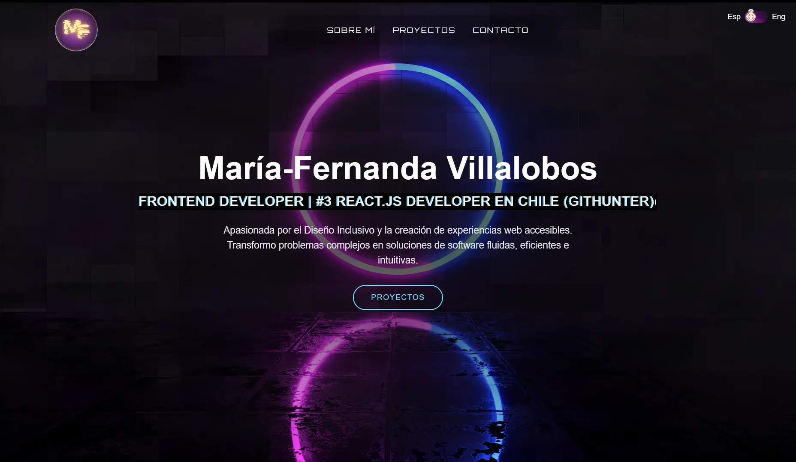

# Marifer VL - Personal Portfolio


### [Live Demo](https://marifervl.vercel.app) ---

## 🚀 About This Project

This is my personal portfolio, designed and built to showcase my skills in frontend development, my projects, and a bit about myself. The project is built from scratch using a modern, performant, and scalable tech stack centered around Next.js 15 and React 19.

The entire site features a clean, futuristic aesthetic with smooth animations and a strong focus on user experience. It is also fully internationalized, supporting both English and Spanish.

## ✨ Key Features

-   **Modern Tech Stack**: Built with Next.js 15 (App Router & Turbopack), React 19, and Tailwind CSS v4.
-   **Internationalization (i18n)**: Fully bilingual (English/Spanish) using Next.js Middleware for locale detection.
-   **Component-Based Architecture**: A clean and organized structure with reusable components for UI elements and sections.
-   **Smooth Animations**: Engaging user experience with animations powered by `Framer Motion`.
-   **Fully Responsive Design**: Looks great on all devices, from mobile phones to desktops.
-   **Optimized for Performance**: Fast load times and optimized builds, thanks to Next.js features and Turbopack.

## 🛠️ Tech Stack

-   **Framework**: [Next.js](https://nextjs.org/) 15.3.5
-   **Library**: [React](https://react.dev/) 19
-   **Styling**: [Tailwind CSS](https://tailwindcss.com/) v4
-   **Animations**: [Framer Motion](https://www.framer.com/motion/)
-   **Internationalization**: [@formatjs/intl-localematcher](https://formatjs.io/) & [Negotiator](https://github.com/jshttp/negotiator)
-   **Icons**: [React Icons](https://react-icons.github.io/react-icons/)
-   **Linting**: [ESLint](https://eslint.org/)

## 📁 Project Structure

The project follows a logical and organized file structure, making it easy to navigate and maintain.

```

/
├── app/
│   └── [lang]/         \# Dynamic routes for i18n (e.g., /en, /es)
├── components/         \# Reusable React components
│   ├── ui/             \# Basic UI elements (Button, Headline)
│   └── ...             \# Sections (Hero, About, etc.)
├── dictionaries/       \# JSON files for language strings (en.json, es.json)
├── lib/                \# Helper functions and custom hooks
├── middleware.js       \# Handles language detection and routing
├── public/             \# Static assets (images, fonts)
└── ...                 \# Config files

````

## ⚙️ Getting Started

To run this project locally, follow these simple steps.

### Prerequisites

Make sure you have Node.js (v18 or later) and npm installed on your machine.

### Installation

1.  **Clone the repository:**
    ```sh
    git clone https://github.com/MariferVL/inner-rework.git
    cd inner-rework
    ```
    2.  **Install dependencies:**
    ```sh
    npm install
    ```

### Running the Development Server

Execute the following command to start the development server with Turbopack:

```sh
npm run dev
````

Open [http://localhost:3000](http://localhost:3000) in your browser to see the result.

## 📜 Available Scripts

In the project directory, you can run:

  - `npm run dev`: Starts the development server with Turbopack.
  - `npm run build`: Builds the application for production.
  - `npm run start`: Starts the production server.
  - `npm run lint`: Lints the code using Next.js' built-in ESLint configuration.

## 📄 License

This project is licensed under the MIT License. See the `LICENSE` file for more details.

## 📫 Contact

**Your Name**

  - **LinkedIn**: [marifervl](https://www.linkedin.com/in/marifervl/)
  - **GitHub**: [@MariferVL](https://github.com/MariferVL)
  - **Email**: marifervl.dev@gmail.com

